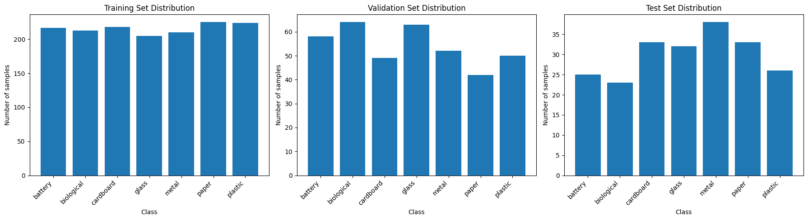
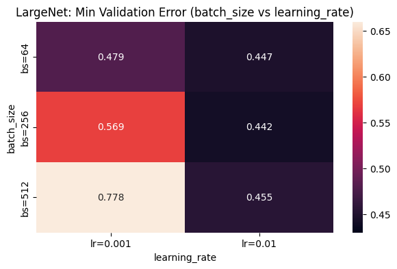

# PyTorch Neural Network Training

Neural-network implementation and PyTorch image-classification workflow covering manual backpropagation, CNN training, hyperparameter tuning, and model evaluation.

## Preview

**Figure 1.** Garbage-classification image distribution across the training, validation, and test splits.

**Figure 2.** Validation-error heatmap used to compare CNN learning-rate and batch-size settings.

## Project summary

This project combines a from-scratch neural network exercise with a PyTorch image-classification pipeline. The first part implements a 2-layer ANN on the sklearn wine dataset to make forward propagation, cross-entropy loss, backpropagation, and gradient checking explicit. The second part trains neural networks for 7-class garbage image classification and compares CNN and fully connected architectures under different hyperparameter settings.

## Problem

This project aims to practice two connected neural-network workflows:

> 1. Build a simple neural network from scratch to understand how neural networks work.
> 2. Train a neural network using PyTorch to classify images from the Garbage Classification dataset into seven classes, including battery, biological, cardboard, glass, metal, paper, and plastic.

The workflow also covers train/validation/test separation, overfitting and underfitting analysis, learning-rate and batch-size tuning, and comparison between a feedforward ANN and a CNN.

## Data

- sklearn wine dataset for the manual 2-layer ANN exercise
- truncated garbage image classification dataset with 2,100 images
- train/validation/test split of 1,512 / 378 / 210 images
- 260-image secret test set used for final prediction CSV outputs

## Techniques

- NumPy implementation of a 2-layer neural network
- one-hot label encoding and cross-entropy loss
- analytical and numerical gradient validation
- PyTorch `Dataset` and `DataLoader` workflows
- convolutional neural networks and fully connected neural networks
- training/validation loss and error tracking
- learning-rate and batch-size experiments
- validation-error heatmap for hyperparameter search
- top-3 class-probability inspection for test predictions

## Achievements

- implemented a vectorized 2-layer ANN with sigmoid hidden activations and softmax output
- compared random initialization against zero initialization on the wine dataset, showing 71% vs 35% training accuracy
- counted model parameters for `SmallNet` and `LargeNet` to connect network size with model capacity
- trained multiple CNN configurations and compared validation behavior across learning rates and batch sizes
- selected a `LargeNet` configuration with `batch_size=256`, `learning_rate=0.01`, and best epoch 22 from the hyperparameter search
- evaluated the selected CNN on the garbage image test set with 64.29% test accuracy
- trained a fully connected ANN baseline and reported 86.19% test accuracy in the notebook run
- generated prediction CSV files for the secret test set using both the CNN and ANN workflows

## Repository structure

| File | Role |
| --- | --- |
| `A1_EdwinXu.ipynb` | Main notebook with model implementation, training, tuning, and evaluation |
| `A1_EdwinXu.html` | Rendered notebook report |
| `labels_part_b5.csv` | Secret test predictions from the selected CNN model |
| `labels_part_b6.csv` | Secret test predictions from the fully connected ANN model |
| `preview_dataset_distribution.png` | Train/validation/test class distribution preview |
| `preview_hyperparameter_heatmap.png` | Validation-error heatmap across learning rate and batch size |

## Skills practiced

This project practices manual neural-network implementation, gradient checking, PyTorch model training, convolutional image classification, hyperparameter tuning, validation-based model selection, and clear reporting of model confidence.
